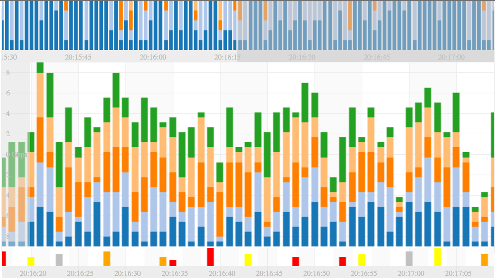
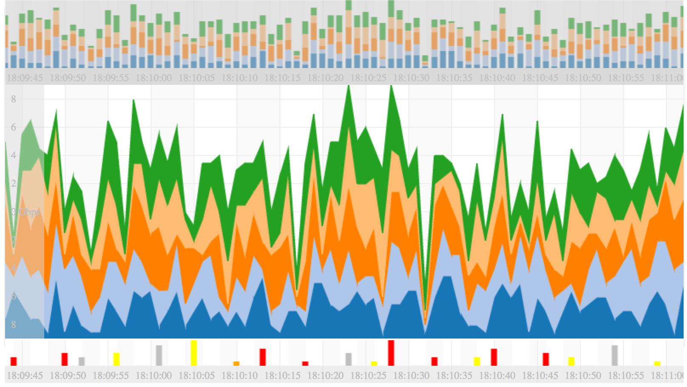
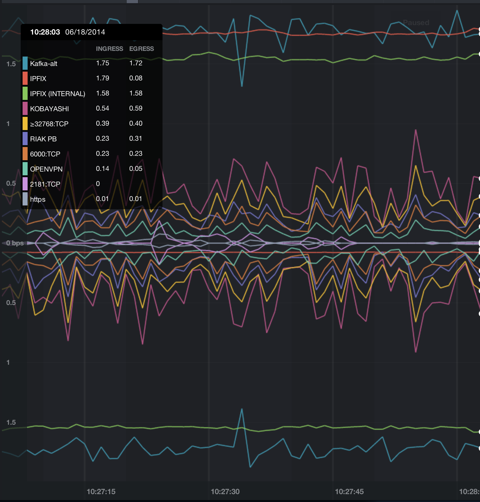
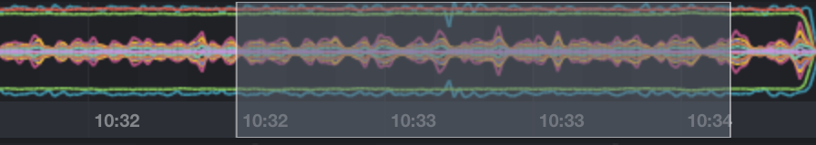
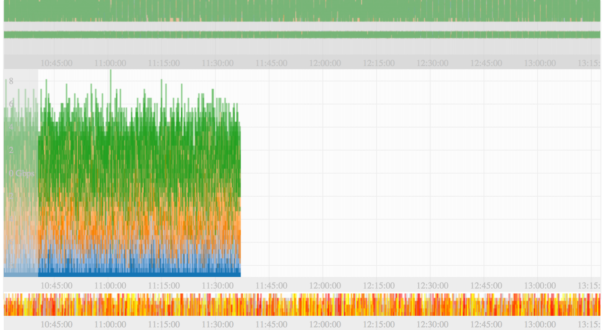
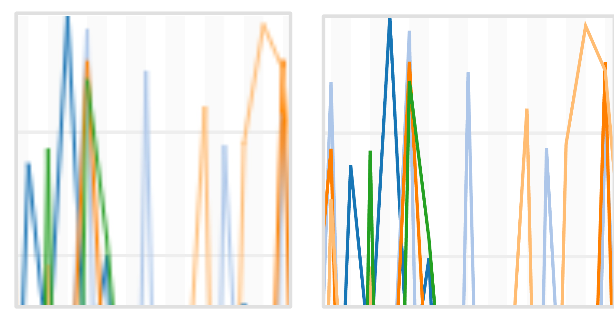

Firespray
=========

Streaming charts library developed by [Boundary](http://boundary.com/)

## Bar charts
#### Stacked, percent bar charts

  

## Line charts

#### Stacked area charts

#### Mirror line charts, everything is stylable

  

#### Range selector

  

## Optimized for large datasets

#### Progressive rendering using [render-queue](http://bl.ocks.org/syntagmatic/raw/3341641/)

  

## Canvas and SVG renderers

#### Canvas for large datasets, SVG for crisp lines at any zoom level

 

## Live examples 
* [Examples on Plunker](http://plnkr.co/edit/uqBDIJsqGlM2E8zNmy5J?p=preview)
* [Time slider](http://bl.ocks.org/biovisualize/raw/bdf17be85fc96d629ade/)
* [Tooltip and info table](http://bl.ocks.org/biovisualize/raw/26c96d4ba4d60c17d64b/)

## Coming soon...
* Documentation
* Unit tests

